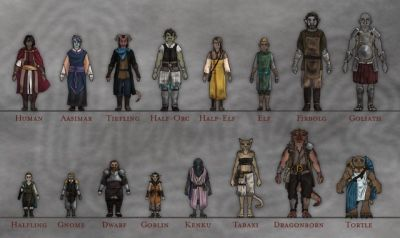
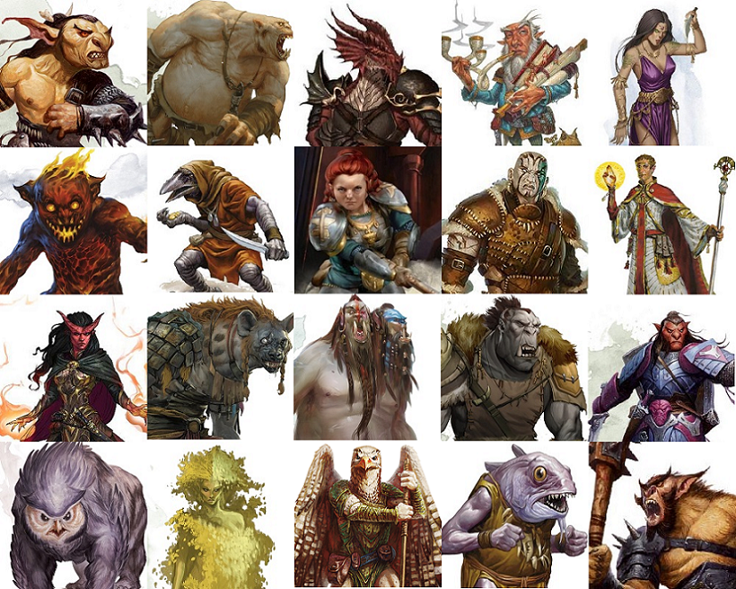

## Character Creation

In general, you'll want to create a fun character who's handy in combat, but also pretty good at
investigating things.  You don't want to spend too much time on it—this is a one-shot, after
all!—but definitely try to put a little bit of personality into it.  Specific guidelines for the
particular aspects of character building are outlined below.

### Ancestry

Your ancestry (or species) will be protean.  You can see the full rules for this custom ancestry
[here], but, in general, you can look like anything you like.  If you want to look like an elf or a
dragonborn most of the time, you can.  You can also just change your appearance on a whim, although
some of the people you meet might find that disconcerting.

   

If you want to look like a typically sized individual, you need to stay in the size range of roughly
sprite-sized to roughly goliath-sized.  However, you can also choose to look like an individual
whose size doesn't conform to standards: feel free to be a 6-foot tall gnome, or a 3-foot tall storm
giant.  However, if you do that, people will pretty quickly figure out that you're not what  you
appear to be.

You can appear to be any age, gender, or body type that you like, and you can change that at any
time.  Pick an alignment as usual, but consider it more of a guideline than a strict code.

### Background

I've outlined a few [Protean-specific backgrounds], but you are not constrained to one of those.
Pick anything you like, or, if you're feeling particularly industrious, make your own.

### Class

Choose any class you want, either from the _Player's Handbook_ or any other source (if the class is
published by a company other than Wizards of the Coast, please check with me first, but I am very
flexible).  You will be a level 6 character, so you will have several cool abilities already,
including your subclass.  Pick any subclass you like as well (same caveats apply).  If you need help
choosing, please let me know and I'm happy to offer suggestions.

### Abilities and Skills

Generate your abilities according to standard point buy (27 points), except that you can go below 8
if you really want to.  I recommend [this online point buy score generator][CD], which I've already
set to "Custom Race" and tweaked the minimum score.  For the "Racial Bonus," you can either take +2
to one score and +1 to another, or +1 to three scores.  Remember that if you try to do anything too
crazy with your shapeshifting, I'll ask for a Constitution check.

Pick whatever skills you want.  The following skills might be useful for your shapeshifting abilities:
* **Deception.** If you choose a form and want to fool other people into thinking you really are
  that thing, you will make a Charisma (Deception) check with advantage.  The DC will depend on how
  complex the form is.
* **Insight.** If you're trying to pick out fellow proteans in alternate forms, you'll make a Wisdom
  (Insight) check with advantage.
* **Nature.** If you want to change into a natural form that you may not be familiar with, you'll
  make an Intelligence (Nature) check to see how close you can get.
* **History.** If you want to change into a man-made form that you may not be familiar with, you'll
  make an Intelligence (History) check to see how close you can get; remember that your object won't
  be functional unless you can personally make that object.

### Equipment

Don't worry about equipment too much.  Assume you have a dungeoneer's pack, any tools you have
proficiency with, and any weapons or armor that you want.  Don't worry about keeping track of how
much money you have: it won't really come up in the one-shot.

## Advanced Features

### Feats

Everyone gets a non-combat feat at first level, to help you flesh out your character concept.  So,
not Dual Wielder, Polearm Master, or Sentinel, but Alert, Keen Mind, or Lucky would be fine.  You
can also take a feat instead of an ability score increase, as usual.

### Multiclassing

You can multiclass if you want to.  Don't worry about ability score prerequisites.

[CD]: https://chicken-dinner.com/5e/5e-point-buy.html#customrace&NA&8&8&8&8&8&8&0&0&27&15&6&19&15&12&9&7&5&4&3&2&1&0&1&2&4&6&9&4&4&4&4&4&4
